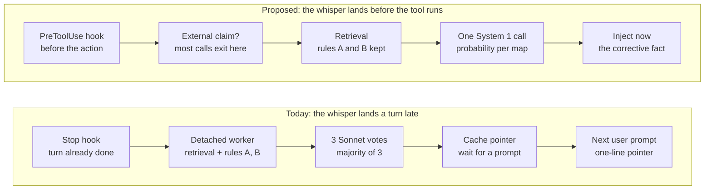

# Listener gate: a System One model for whispers

2026-10-07 · Jason Weddington · Status: PROPOSED

## How to use this brief

The cheapest win is not a cheaper judge. A decision model fast enough to run inline lets the whisper land at the moment the agent acts, not the turn after, and that is more likely to move consumption than any change to the vote. This brief is for the Claude Code session working on **personal-kb-mcp**. It proposes five changes to the listener (whisper) path and the experiments that decide each. Treat every item as a hypothesis, not a decision.

Rules for acting on it:

- **Precision stays at 1.00.** The post's asymmetry stands: a wrong whisper corrupts what the model reasons from next. Every change is judged first against the offline gate harness (the kb-01725 fixtures and `run_gate15.py`), and nothing that loses precision ships.
- **Shadow before switch.** Each change runs beside the current path, logged to `listener_decisions`, before it changes what any agent sees.
- **Kill switch per change**, default off, the same shape as `KB_LISTENER_ENABLED`.
- **Separate the gate from delivery.** If consumption stays near zero after a gate change, the problem is delivery or content, not the judge. The experiments are ordered so each result tells you which.
- Figures below come from the 34-hour `listener_decisions` window in `kb-service/docs/nightly-map-maintenance-design.md` (through 2026-09-19). Re-read them from current telemetry before acting; the post-improvement numbers may differ.

## Today's pipeline, and where the frontier calls go

The frontier spend sits on the "which map, if any" question, and the losses happen after delivery. In the 34-hour window, 151 decisions produced 72 that reached the jury, which is 216 Sonnet calls for 6 whispers. Consumption was 1 of 59 on the listener channel.



Today (top row): the Stop hook sends the first 4,000 characters of the agent's last message (skipping anything under 200) to a detached worker; the service retrieves up to 5 candidate maps by project-name or title match and by detail-entry search, drops them by Rule A (same project) and Rule B (`operated_via`), runs three concurrent Sonnet votes, and returns up to 2 pointers by majority plus a second-slot evidence bar. The hook caches the result and appends "Possibly relevant map — [kb-id] title" on the next user prompt. Headless runs have no next prompt. The proposed row never blocks the tool and fails open on timeout; it is explained in sections 1 to 4.

## 1. Replace the 3-Sonnet jury with one decision-model call

The gate prompt in `listener_routes.py::_build_prompt` already asks a System 1 question: for each candidate map, is the agent asserting or assuming specific facts that map's domain would confirm or correct? That is a yes/no per candidate, answered three times by Sonnet and reduced by majority. Majority-of-3 estimates whether p ≥ 0.5 from three samples, in steps of one third. A decision model returns that probability directly, per candidate, in one forward pass, so the threshold becomes a continuous dial tuned to hold precision at 1.00.

Decision models share one API: Ollama's `/v1/systemone`, or `typesafe-sdk` pointed at it. Options: [clef-flash](https://ollama.com/library/clef-flash) (9B, Apache 2.0, about 39 ms median), [clef](https://ollama.com/library/clef) (27B, about 209 ms), or [Jev](https://typesafe.ai/blog/introducing-system-one-models-and-jev) (hosted only, trained for calibrated probabilities). All latency and accuracy figures are vendor-reported.

Sketch of the request (question keys are illustrative; generate one `noul` per surviving candidate):

```json
{
  "model": "clef-flash",
  "state": {
    "agent_text": "<last assistant text, first 4000 chars>",
    "session_project": "<cwd_project>",
    "candidates": {
      "kb-01724": "<short_title>\n<first 400 chars of knowledge_details>",
      "kb-03257": "..."
    }
  },
  "questions": {
    "external_claim": {
      "type": "noul",
      "instructions": "Is the agent asserting or assuming specific facts about a system outside this project: which machine runs what, how a service is wired, network topology?"
    },
    "map_kb_01724": {
      "type": "noul",
      "instructions": "Would the kb-01724 map's domain confirm or correct a specific fact the agent asserts? Shared vocabulary, tooling mentions or topical adjacency are not enough."
    },
    "acting_on_it": {
      "type": "noul",
      "instructions": "Is the agent about to write code, config or commands that depend on that assumption?"
    }
  }
}
```

Two questions here are new and worth testing separately:

- **`external_claim` is a "whether" gate that needs no candidates.** It can run before retrieval. Most Stop events are ordinary in-project coding, so most requests would exit before the detail search, the owning-map lookup and the vote. Candidate scoring answers "what"; this answers "whether", and they are separate questions.
- **`acting_on_it` ranks by cost of being wrong.** Whisper preferentially when the agent is about to build on the assumption, which is where the post says a wrong belief costs most.

What stays: Rule A (cross-project) and Rule B (`operated_via`) are deterministic and cheap; keep them ahead of the model. The second-slot evidence bar (`_meets_second_slot_bar`) also stays, applied after the probability threshold.

Log the model's probabilities on every jury-reaching decision as a new `listener_decisions` column (for example `s1_probs`, JSON keyed by question), next to `vote_shape`, so the two judges can be compared row by row.

## 2. Whisper at the moment of action

Today the whisper is computed on **Stop** by a detached worker and appended on the **next UserPromptSubmit** (`personal_kb_hook/cli.py`). It therefore lands one turn late: after the agent has asserted the fact and often acted on it, and after the human's next prompt may have changed the subject. The detached worker exists because three Sonnet calls are too slow for an inline hook. A local decision model removes that constraint.

Proposal: a synchronous **PreToolUse** path.

1. On PreToolUse, take the assistant text that preceded the pending tool call plus the tool name and input (the hook payload carries both; confirm the exact fields).
2. Run the `external_claim` question. Most calls exit here.
3. On a yes, run retrieval, Rules A and B, and the per-candidate questions, with `acting_on_it` weighted by the pending tool call itself.
4. On a confident hit, return the whisper as `additionalContext` (or the PreToolUse equivalent) so it reaches the model before the tool runs. Never block the tool call; this is advice, not a gate.

Budget: the whole path must stay well under a second, and should fail open (no whisper) on any timeout. Clef-flash at about 40 ms per call leaves room for the retrieval queries; measure end to end on the real host.

**The headless gap.** As far as the code reads, a headless `claude -p` dispatch run has no next UserPromptSubmit, so listener whispers computed on its Stop are never delivered. Verify against `whisper_telemetry` split by `build_engine` (set from `HEADLESS_BUILD_ENGINE`). If it holds, the factory's headless agents, the population most likely to act on a wrong assumption unsupervised, currently get no listener whispers at all, and a PreToolUse path is the only way they would.

## 3. Read the reasoning, not just the final message

The gate never sees the agent's reasoning. `listener.py::extract_manifest` keeps only `text` blocks (it skips `thinking` blocks entirely), takes only the last assistant record that has text, and keeps its first 4,000 characters. If Claude Code writes one transcript record per content block, as it appears to, that is often just the turn's closing summary to the user: the least assertion-dense part of the turn.

Reasoning is where confident wrong beliefs are easiest to catch. The IPTC false dones in harness-design design 05 are the worked example: the agent recited the wrong field list in its reasoning many times before it wrote the stripper or the test. Reasoning states things as settled without the hedging of user-facing text, and it comes before the action, so a whisper there can prevent the mistake instead of chasing it.

Proposal:

- **Extract the current turn's `thinking` blocks** as a separate `reasoning` field, next to `text`, never concatenated. Take the tail of the turn's reasoning, not the head.
- **Pair it with PreToolUse** (section 2): the reasoning that led to this tool call, plus the call itself, is the ideal input. Verify the thinking block is in the transcript by the time PreToolUse fires.
- **Separate beliefs from hypotheses.** Reasoning is exploratory; "maybe the worker runs on pi-04, let me check" is fine and whispering on it is noise. Add one question: `noul` "Is the agent treating this as settled fact, not a hypothesis it is about to verify?"
- **Handle volume by chunking.** Split long reasoning and run the cheap `external_claim` question per chunk; only chunks that pass go to retrieval. This is affordable at decision-model prices and not at three Sonnet calls per chunk.
- **Record the trigger source** (`text` or `reasoning`) in `listener_decisions` and `whisper_telemetry`, so reasoning-triggered whispers can be compared with text-triggered ones.

Fidelity varies by source. On recent Claude models, Claude Code transcripts may hold summarized thinking, not the raw trace, and some blocks may be redacted. Talos is the opposite: `--transcript` records full reasoning text on the GLM and Qwen lanes, so the factory's own harness has the richest signal and can call the decision model in-process, with no hook.

First test, offline: for the known-mistake fixtures in the kb-01725 harness, pull the reasoning from the original transcripts and check whether the wrong assertion appears there earlier, or more explicitly, than in the final text. If it does, wire it in behind its own kill switch.

## 4. Whisper the corrective fact, not a pointer

The whisper today is one hedged line, "Possibly relevant map — [kb-id] title" (`render.py::render_whisper`), and evaluating it costs the agent a `kb_get` call. A busy agent skips a hedged suggestion that costs a tool call to check.

Retrieval already knows more than it says. `_retrieve_candidate_maps` finds the chunky detail entries that matched the agent's text before resolving them to their owning map. A decision model can pick, from those top-20 detail hits, the single entry that would correct the agent's claim: one `choice` question with up to 26 options, including a `none` option. The whisper then carries that entry's one-line fact plus its id, with the map as context:

```text
KB note [kb-00082]: <the one-line fact>  (map: [kb-01724] <short_title>)
```

This is a different question from the one the post settled. "More material made the judge worse" was about the judge's input. This is about what the agent receives. Treat it as an A/B on consumption, with the pointer-only whisper as control, and keep the gate's input unchanged.

## 5. Measure consumption by behavior

Consumption is counted only when the agent calls `kb_get` or `team_kb_get` on the whispered id (`telemetry.py::mark_consumed`, on PostToolUse). That misses an agent that corrects itself from the whisper text alone, which proposal 4 makes the expected case.

Add a behavioral check on the agent's next turn, run by the same decision model:

- `noul`: "Did the agent change, qualify or verify the claim the whisper addressed?"
- State: the claim text that triggered the whisper, the whisper, and the agent's next assistant text.

Record the probability on the `whisper_telemetry` row next to `consumed`. Report both signals: "fetched" (today's) and "acted on" (new). A whisper that is acted on without being fetched is a success the current metric counts as a miss.

## Experiments, in order

Each is one or two GTD items. The order matters: 1 and 2 are cheap and tell you whether the judge can be swapped; 3 and 4 tell you whether delivery and content were the real problem.

| # | Experiment | Mode | Success | Kill |
| --- | --- | --- | --- | --- |
| 1 | Offline: run the decision model against the kb-01725 harness | Offline, no production change | At precision 1.00, recall at least the 3-Sonnet jury's; `external_claim` alone rejects most negative fixtures | Cannot reach precision 1.00 at any threshold that keeps positives |
| 2 | Shadow: log `s1_probs` beside `vote_shape` on every jury-reaching request | Production, log only | After about two weeks, the model and the jury agree on every jury `whispered` row; threshold chosen from the data | Disagreements on whispered rows that review shows the model got wrong |
| 3 | Behavioral consumption check (proposal 5) on the current whispers | Production, log only | A readable "acted on" rate exists for the current path, as a baseline for 4 and 5 | The check itself disagrees with human review on a 20-whisper sample |
| 4 | Synchronous PreToolUse whisper (proposal 2), interactive sessions first | Behind its own kill switch | "Acted on" rate clearly above the step-3 baseline; no measurable hook latency for users | No consumption change, or users notice latency |
| 5 | Corrective-fact whisper (proposal 4) vs pointer-only | A/B on the step-4 path | Higher "acted on" rate with no rise in wrong-whisper reports | Agents act on a wrong fact the whisper supplied |
| 6 | Extend PreToolUse whispers to headless dispatch runs | After 4 and 5 hold | Headless runs receive whispers; no change in dispatch pass rate | Any rise in false dones or stuck runs on the dispatch fleet |

Thresholds are starting points for the groom to argue with.

## Caveats

- **Clef's `confidence` is not the probability of being right.** It measures how concentrated the probabilities are. Choose thresholds from the harness and the shadow data, never from the raw numbers. Jev claims calibration, but that claim is vendor-tested and Jev is hosted-only.
- **Hardware.** Clef-flash needs about 11–12 GB of VRAM, and the 5090 is fully used when qwen runs at 256K, so the model likely needs its own host, or Jev's hosted API.
- **A cheaper judge does not fix ignored whispers.** Swapping the jury mostly buys cost and latency. The latency is what makes proposal 2 possible, and proposals 2 to 4 are where consumption is most likely to move.
- **The window is old.** The figures here predate the latest listener changes. Re-run `scripts/listener_decision_report.py` before deciding anything.

## Sources

- [The Knowledge Base That Whispers](https://blog.jasonweddington.com/the-knowledge-base-that-whispers/)
- [personal-kb-mcp](https://github.com/jason-weddington/personal-kb-mcp): `kb-service/src/kb_service/routes/listener_routes.py`, `personal-kb-hook/src/personal_kb_hook/cli.py`, `listener.py`, `render.py`, `telemetry.py`, `kb-service/docs/nightly-map-maintenance-design.md`, `kb-service/scripts/listener_decision_report.py`
- [clef-flash](https://ollama.com/library/clef-flash) and [clef](https://ollama.com/library/clef) — Ollama library
- [Introducing System One Models & Jev](https://typesafe.ai/blog/introducing-system-one-models-and-jev) — TypeSafe AI
